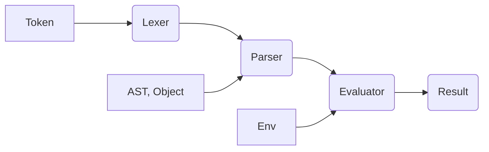

# DESERT MONKEY 🏝️🐒


[](https://opensource.org/licenses/MIT)

### An interpreter for a toy-language, built from scratch in OCAML !

## Features :
 - Supports integer, boolean, and string datatypes.
 - Supports function declarations.
 - supports recursion.
 - Supports the List data structure.
 - Arithmetic operations: +, -, *, /, %.
 - Conditional statements with if-else blocks.
 - Includes a REPL for interactive evaluation.
 - Error handling for invalid syntax and type errors.

## Architecture :
- The interpreter consists of mainly three components.
    1) The Lexer.
    2) The Parser.
    3) The Evaluator.
- The lexer is supported with a module `Token` that has defined the various tokens of this toy language. The main purpose of the lexer is to Tokenize the input code into valid tokens.
- The parser then takes these valid tokens and constructs an Abstract Syntax Tree (AST) from them. The structure of the AST is defined in the `Ast` module. The parser that is built for this language uses the pratt-parser design, which is a top down recursive approach.
- The Evaluator then finally traverses the AST and interprets and executes the commands.


## Testing :
- Unit tests cover:
    - Lexer tokenization
    - Parser structure
    - Evaluator correctness (including recursive functions like Fibonacci)

- Tests are written using [Alcotest](https://github.com/mirage/alcotest).

Run tests with:

```sh
    cd desert_monkey
    dune test
```
## Build :

Note : You must have OCAML and OPAM installed in your device to build this project, for obvious reasons. 
```sh
cd desert_monkey
dune build
```

## Run REPL :

```sh
cd desert_monkey
dune exec ./_build/default/bin/main.exe
```

## Example :

```
>> let add = fn(a, b) { return a + b; };
>> add(2, 3); // Int(5).
```

## References :

- This project is based on the book ["Writing an Interpreter in Go"](https://interpreterbook.com/) by Thorsten Ball.

- Built independently with some reference to public open-source implementations.

## Licence :
- MIT

## Future Features :

- support for floating point integers.
- complete the line and col no in error handling.
- Self healing code capabilities using LLM suggestions for errors? must make it different from a glorified auto-complete.


